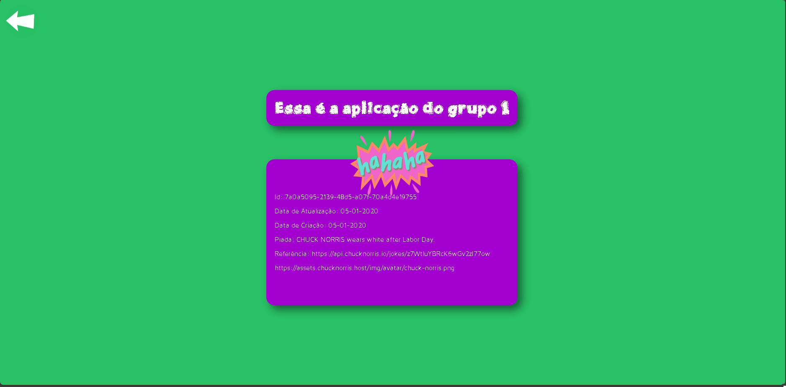
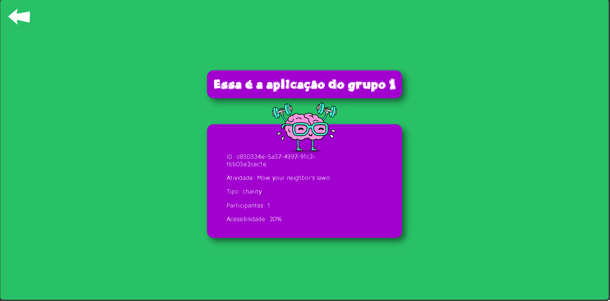

# EQUIPE 1 - JOKES AND ACTIVITIES

## 🏋️ Desenvolvimento do Projeto

- Através do orientado no repositório oficial, consume-se as APIs indicadas e aplicam-se as alterações de acordo com o proposto.
- Também realiza-se o deploy no Amazon BeanStalk.

    **1. Reunião Inicial:** Divisão de tarefas e responsabilidades de acordo com o interesse do desenvolvedor.
    
    **2. Backend e Conexão com API:**  Definição de metódo de requisição e formatação do conteúdo retornado.
    
    **3. Desenvolvimento da Página Web:** Criação de interface e comunicação com o back-end.
    
    **4. Testes no Ambiente Local:**  Testagem de retorno e formatação.
    
    **5. Deploy na Nuvem AWS:**  Deploy de acordo com tutorial sugerido no Amazon BeanStalk
    
    **6. Documentação final do projeto:** Elaboração do README e descrição de uso, arquitetura e funcionamento.

### ☕ Processo organizacional e de desenvolvimento
-   **Reuniões de Alinhamento**: Definição de responsabilidades;
- Uso do metodo Kanban para desenvolvimento ágil;
- Feedback constante de cada desesnvolvedor do grupo;
- Compartilhamento de experiências.
 
### 🚨 Dificuldades Encontradas
- Econtrar uma maneira de formatar o conteúdo retornado de acordo com o proposto;
- Dificuldade em trabalhar o retorno das classes.


## ⁉️ Como usar o nosso sistema?

 ### ⬇️ Instalação
1. Faça o clone do repositório;
2. Instale as dependências com o comando no terminal: ```npm install ``` ;
3. Dentro do diretório SRC digite o comando no terminal : ``` node server.js ```;
4. Abra seu navegador na porta localhost:3000.
 


## 📂 Estrutura de Pastas e Arquivos


### 🔨 Stack utilizada
[](https://code.visualstudio.com)
[](https://www.javascript.com)
[](https://www.w3.org/standards/webdesign/htmlcss)
[](https://www.w3.org/standards/webdesign/htmlcss)
[](https://nodejs.org/en)
[](https://nodejs.org/en)
[](https://git-scm.com)
[](https://aws.amazon.com)


## 🌟 Demonstração
### Tela inicial:
- Apresenta-se 2 botões que direcionam a sua respectiva guia de acordo com o descrito em cada um deles.

### Página de piadas:
- Apresenta as informações formatadas da API de piadas do Chuck Norrys e o botão de retornar indicado pela seta branca.

### Página de atividades:
- Apresenta as informações formatadas da API de atividades e o botão de retornar indicado pela seta branca.

 
 

## Licença de uso
- Livre para replicação, melhorias e alterações.
- Sob as diretrizes do **MIT**.

## 🧑‍💻 Autores
  - [Ana Beatriz Lara Giampedro](https://github.com/Bia-Lara)
  - [Joao Vitor Farias Soares](https://github.com/joaov12)
  - [Johnathan Rafael Santos Borba](https://github.com/dev-johnathan)
  - [Lyandra Fernandes Cardoso](https://github.com/LyaCardoso)
  - [Maria Rocha Monteiro Camara](https://github.com/Maria-monteiro)


